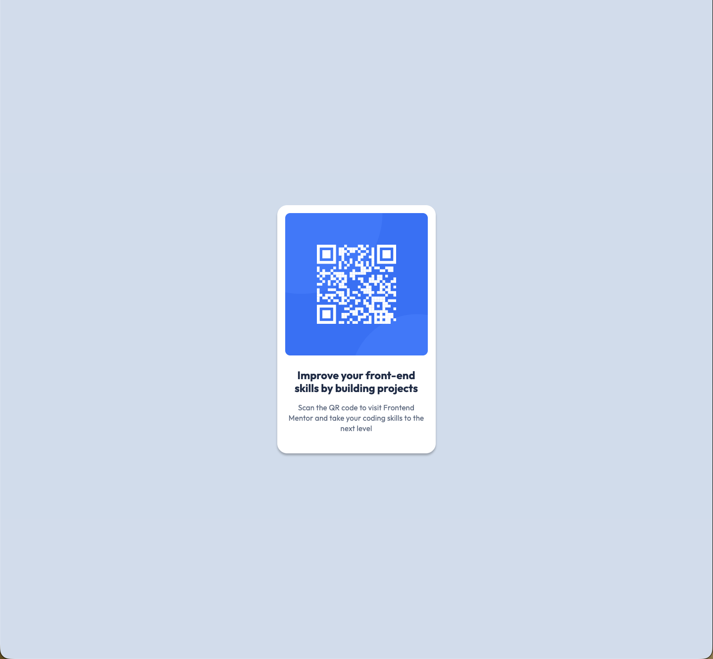

# Frontend Mentor - QR code component solution

This is a solution to the [QR code component challenge on Frontend Mentor](https://www.frontendmentor.io/challenges/qr-code-component-iux_sIO_H). Frontend Mentor challenges help you improve your coding skills by building realistic projects.

## Table of contents

- [Overview](#overview)
  - [Screenshot](#screenshot)
  - [Links](#links)
- [My process](#my-process)
  - [Built with](#built-with)
  - [What I learned](#what-i-learned)
  - [Continued development](#continued-development)
  - [Useful resources](#useful-resources)
- [Author](#author)
- [Acknowledgments](#acknowledgments)

## Overview

### Screenshot



### Links

- Solution URL: [Add solution URL here](https://your-solution-url.com)
- Live Site URL: [Netlify](https://qr-code-component-ts.netlify.app/)

## My process

### Built with

- HTML 5
- CSS

### What I learned

- Recap of basic HTML and CSS

- Using responsive units (rem):

  ```css
  .card-content {
    text-align: center;
    padding: 0.4rem;
  }

  .card-content-heading {
    font-size: 2rem;
    font-weight: 700;
    margin-bottom: 1.6rem;
    display: inline-block;
  }
  ```

- Taking care of accessibility via 'alt' property for images

  ```html
  
  ```

- Providing a description for the page

  ```html
  <meta
    name="description"
    content="A simple QR code component consisting of the picture of an QR code and a description.
      The QR code points to the Frontend Mentor website. The description contains a short heading and some further
      text to assist the user."
  />
  ```

### Continued development

- Practicing and understanding box-shadow and its parameters further

## Author

- Frontend Mentor - [@tschaffroth](https://www.frontendmentor.io/profile/tschaffroth)
